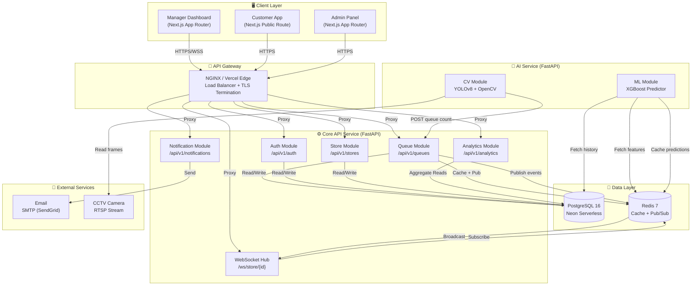
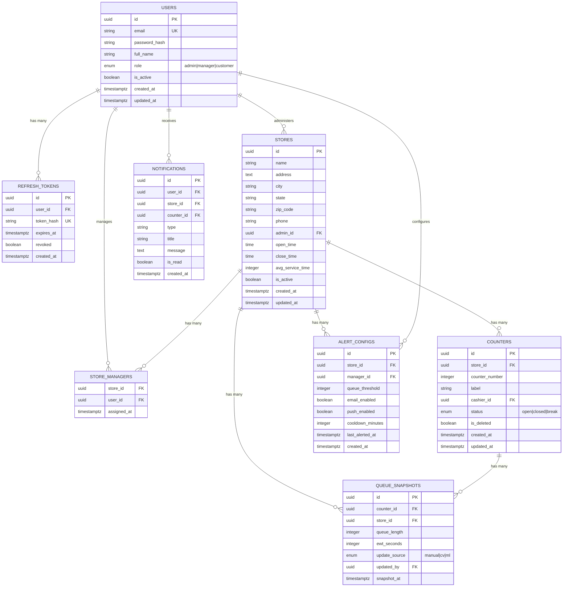
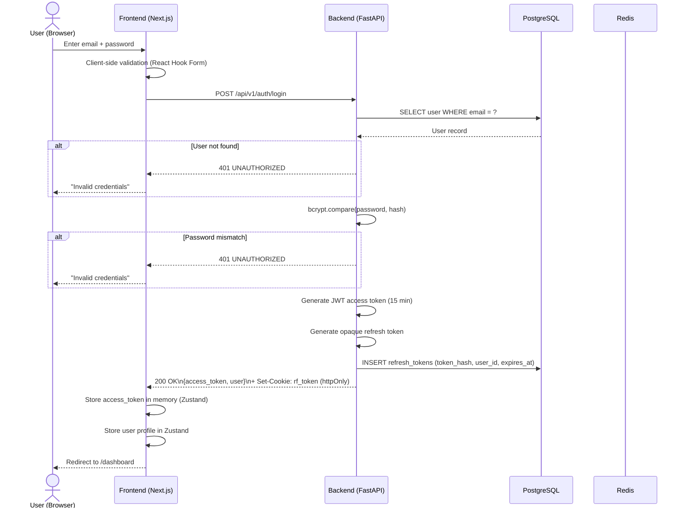
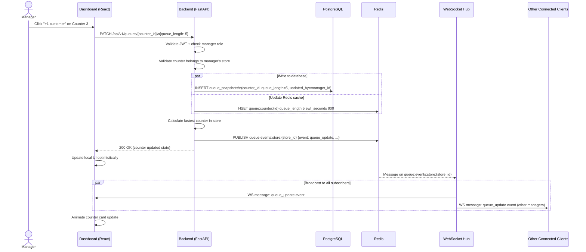
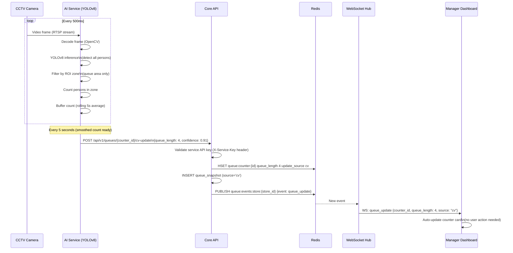
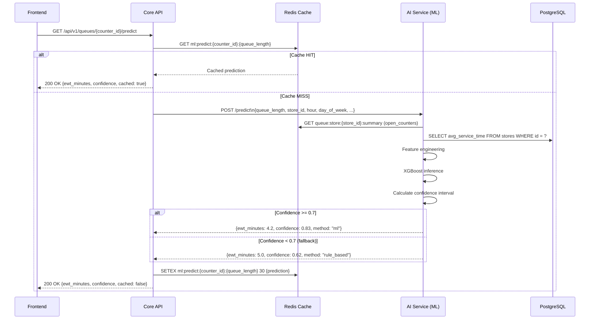
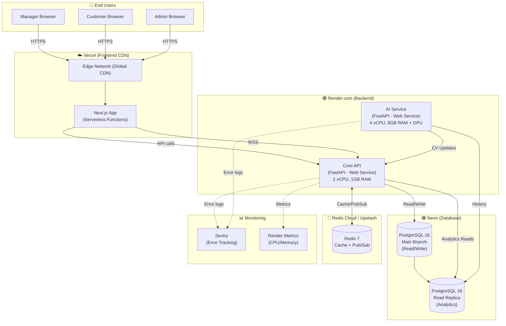
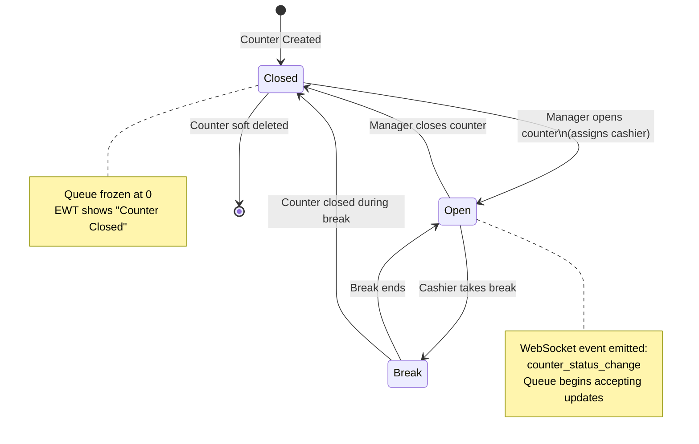
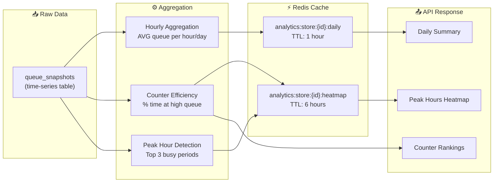

# RetailFlow AI — Architecture Diagrams

**Version:** 1.0.0  
**Tooling:** Mermaid.js (render at mermaid.live or in any Mermaid-compatible viewer)

---

## Diagram 1: System Architecture (Component View)

---

## Diagram 2: Entity-Relationship (ER) Diagram

---

## Diagram 3: Sequence Diagram — User Login Flow

---

## Diagram 4: Sequence Diagram — Real-Time Queue Update

---

## Diagram 5: Sequence Diagram — Computer Vision Auto-Update

---

## Diagram 6: Sequence Diagram — ML Wait Time Prediction

---

## Diagram 7: Deployment Diagram (Production)

---

## Diagram 8: State Machine — Counter Status

---

## Diagram 9: Data Flow — Analytics Pipeline

---

*Diagrams generated with Mermaid.js | View at https://mermaid.live*  
*Version: 1.0.0 | RetailFlow AI Engineering Team*
